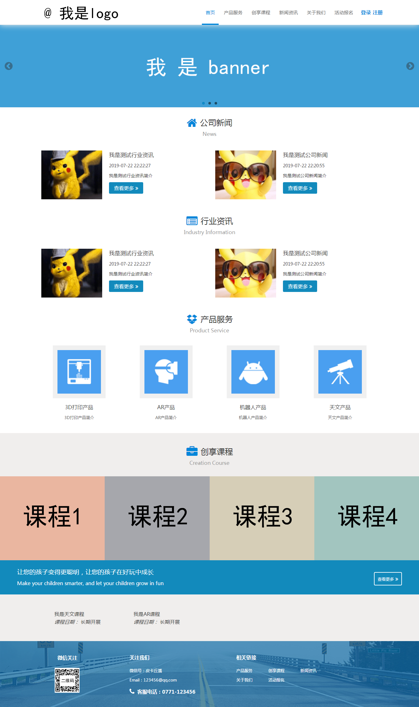
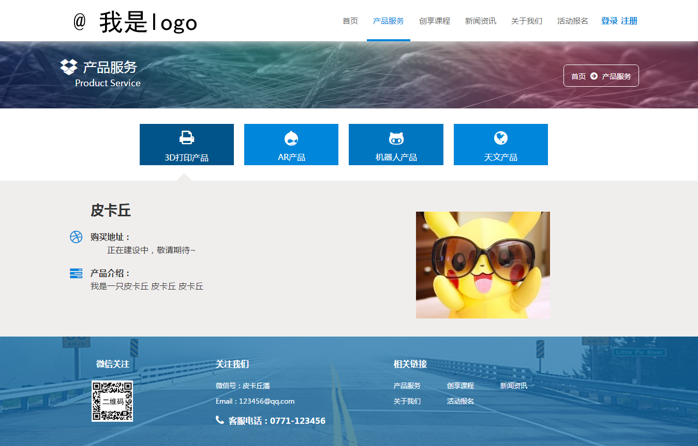

# 简要说明
- 这本来是个人为公司独立开发的网站，现已被弃用，所以公开源码。
- 已移除有关公司的所有信息，所以还未进行全面改良及测试，可能存在bug，后面会不断更新。
- 网站包括产品、课程、新闻、活动、会员五大模块，前台进行内容的展示，后台进行内容的配置，并包括管理员权限模块。
- 前台的前端使用了在网上找来的模板，该模板使用了layui框架，前台则是根据这个模板以及公司需求进行了改造。
- 后台的前端全部为个人独立撰写。
- 项目使用了laravel后端框架的5.4版本进行开发。

——————————————————————————————
# 要求环境
- php 5.4.*
- composer
——————————————————————————————
# 安装步骤
- 下载本项目并解压
- composer install
- 将.env.example复制为.env，并且更改.env中的数据库相关信息
- php artisan key:generate（系统自动生成.env文件中的APP_KEY）
- php artisan migrate（根据项目迁移文件创建项目所需数据库表）
- php artisan db:seed（根据项目填充文件增加数据库表中所需数据）
- 该项目站点映射至项目路径的public目录
- （可删除项目中的doc_images文件夹，该文件夹存的是read.md所需展示的项目效果图）
——————————————————————————————
# 效果图
### 前台
- 首页

- 产品服务（待增加内容，并且后台待增加产品上传功能）

- 创享课程

- 新闻资讯

- 关于我们

- 活动报名

- 登录

- 会员中心

### 后台
- 登录

- 首页

- 用户模块

- 运营模块

- 系统模块

